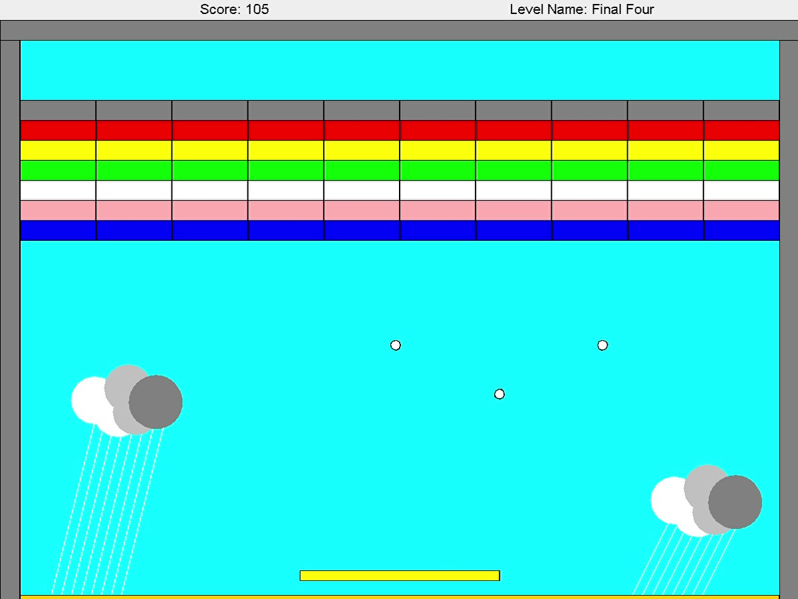

# Arkanoid


### Prerequisites:
To run the project easily, install `ant` following the instructions in the wiki page:
https://github.com/TomBekor/Arkanoid/wiki/Installing-Apache-Ant 

## Running Walkthrough
Clone this repository with the command:
```
git clone https://github.com/TomBekor/Arkanoid.git
```
To start playing the game, run:
```
cd Arkanoid
ant run
```
To play specific levels, place their names (1 to 4) in the order you want to play them, as in the example below:
```
ant -Dargs="2 1 4" run
```
Have fun!